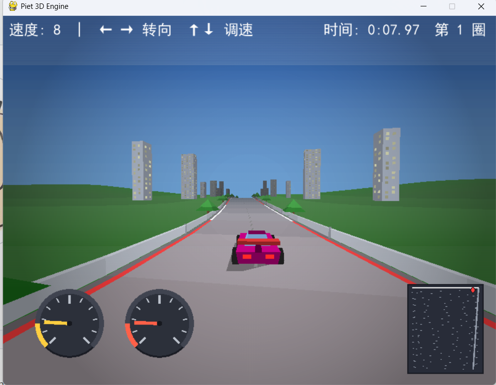
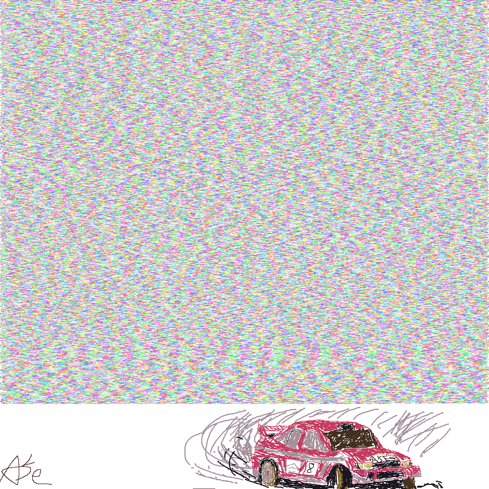

# Piet 3D Racing Game

**English | [中文](README.md)**

> **A word from the author**: After finishing a previous project (a "Power Glide"-style game),
> I stumbled upon Piet — an esoteric programming language that deeply fascinated me.
> The more I learned about it, the more I realized it didn't seem capable of doing 3D games.
> And so this project was born out of a single question: **can Piet actually build a 3D game?**

> Please note: all the code was AI-generated. The human part went into the design decisions,
> and into the drawing on the whiteboard area below the main code (I can't draw,
> so I spent a long time with a mouse 💦).

> I know being AI-generated might draw some criticism online. Please go easy on me 😭



A 3D racing demo where **every decision lives inside a Piet program image**. Python only
acts as Piet's "hands": it runs the interpreter (VM), handles window/keyboard I/O, and
renders the values Piet computes into pixels. **All game logic (player position, speed,
collision, laps, biomes, camera pose) is computed at runtime by Piet instructions.**

## Technical Highlights

**What is Piet?** A deeply esoteric programming language: the program isn't text — it's a
**picture** made of colored blocks. The interpreter starts at the top-left corner and walks
block by block, deciding which instruction to run from the **RGB color difference between
two colors** — all with a single stack, no variables, no functions, and no loops.

**Why is this project hard?**

- **No functions, no variables — just one stack and a DP/CC pointer.** All game logic
  (speed clamping, collision detection, biomes, camera pose) has to be derived with pure
  stack formulas.
- **Instructions come from colors.** "Writing" the program means arranging RGB pixels into
  specific shapes. An integer has to be decomposed digit by digit, and each PUSH block must
  be ≤10 wide — otherwise a row wrap would change the turning semantics.
- **Serpentine layout + black walls for turning.** The code is laid out back-and-forth in a
  1803×1803 frame; black walls guarantee the turning geometry is fully deterministic.
- **Math done entirely with integers.** Piet has no floats. `sin` uses fixed-point with a
  Taylor-3 polynomial; `π` is reduced with `MOD` plus quadrant folding; pseudorandomness
  comes from an on-the-fly linear congruential generator (LCG) — all `DIVIDE/MOD`, integer
  only, with ≤1% error.
- **No "loops" — learned jumps instead.** Since Piet can't express loops, `EXT_SKIP_IF` +
  `EXT_FRAME_START` implement a guard branch: record the block position on the first frame,
  then mechanically jump on every later frame.
- **One picture is the source of truth.** `game_core.png` (450k+ codels) determines all
  world data and rules at compile time; Python only interprets and renders, with zero game
  decisions at runtime.

**The result:** not just runnable — it ships an OpenGL 3D renderer, HUD gauges
(speedometer / rev counter / timer / minimap), a multi-biome track, and particle effects
(falling leaves), all holding within the **60fps** target.

## Controls

| Key | Action |
|---|---|
| `←` / `→` | Turn left / right |
| `↑` / `↓` | Accelerate / decelerate |
| `Esc` or close window | Quit |

The HUD shows a speedometer, a rev counter, a timer, and a minimap. The track passes
through several biomes (city / beach / hills, etc.) — watch out for trees and buildings.

## Requirements

- Python 3.8+ (3.11 recommended), Windows / macOS / Linux
- Dependencies are listed in `requirements.txt`. Install with:

```bash
pip install -r requirements.txt
```

## Run

```bash
python run_game.py
```

On startup it regenerates `game_core.png` (the Piet program itself, 450k+ codels) while
preserving the artwork from the previous session, then enters the main game loop.

## Project Structure

| File | Purpose |
|---|---|
| `racing_game.py` | Engine core: Piet assembler, Piet interpreter, OpenGL renderer, HUD |
| `piet_asm.py` | Piet assembly standard library (fixed-point sin, LCG, loop/branch macros) |
| `paint_core.py` | Tool for drawing in the program image's artwork area (by hand) |
| `run_game.py` | One-click entry point |
| `game_core.png` | The generated Piet program itself (the source of truth for decisions) |

> By "pure Piet-driven" I mean this 1803×1803 image: `game_core.png` *is* the "source code"
> of the game logic. At runtime the interpreter walks the codel blocks one by one and
> executes the instructions inside — every game decision is computed in this image.



## Debug Environment Variables (for automation, use with care)

| Variable | Purpose |
|---|---|
| `PIET_FORCE_2D=1` | Force the software raster (2D) fallback channel (when OpenGL is unavailable) |
| `PIET_SEEK_Z=<int>` | Jump to a specific track position |
| `PIET_DEMO_STEER=1` | Simulate steering automatically, for headless screenshot verification |

The `verify_*.py` / `smoke_*.py` scripts under the `痛苦旅程/` directory are milestone
regression tests used during development.